Xamarin Forms is multiplatform with as much code-reuse as possible. I worked quite some time with iOS and android, but never had set foot to other platforms, so I wanted to see how well Xamarin Forms works out of the box on other platforms with the focus on desktop.

I wanted to cover 
* iOS
* Android
* Windows (UWP/WPF)
* Linux (GTK)
* macOS ("standard" and Frank Kruger's Catalyst version)

I used the Vs4mac Template for multiplatform app with flyout, non-shell. I updated everything to the latest Xamarin Forms and Essentials.

I documented my efforts in a github repo: [https://github.com/hot33331/XamarinFormsEverywhere](https://github.com/hot33331/XamarinFormsEverywhere)

## iOS
As expected iOS works great, no hiccups, everything is fine.

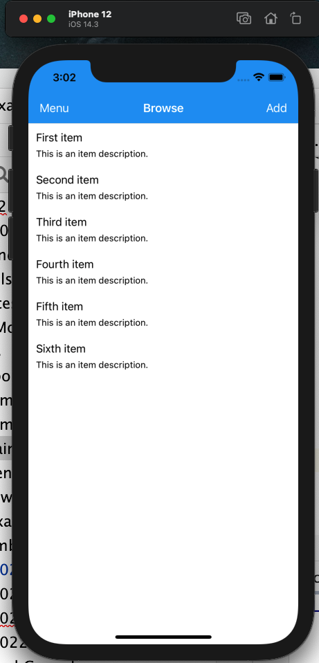

## android
See iOS.

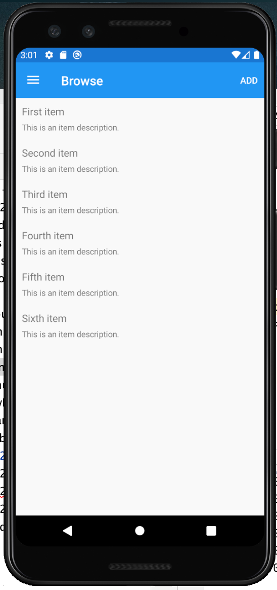

## Windows
Now this is where things get interesting. UWP runs okay if you know that you have to click on the dots in the upper right to get the menu for adding things.

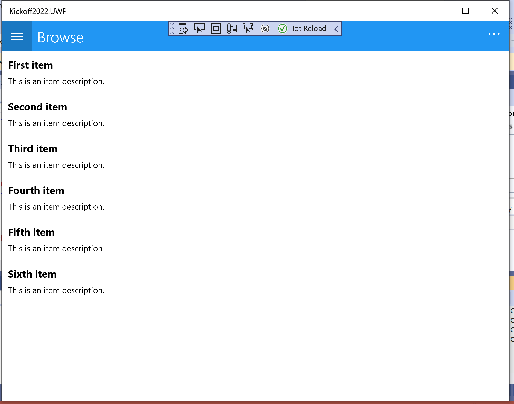

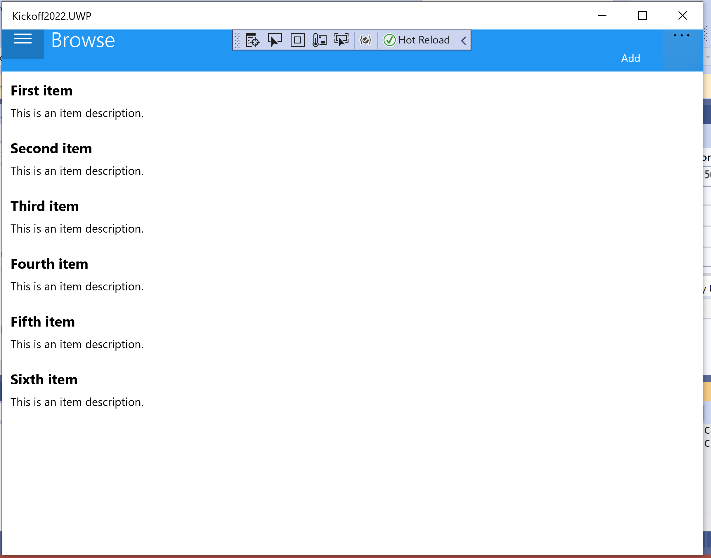

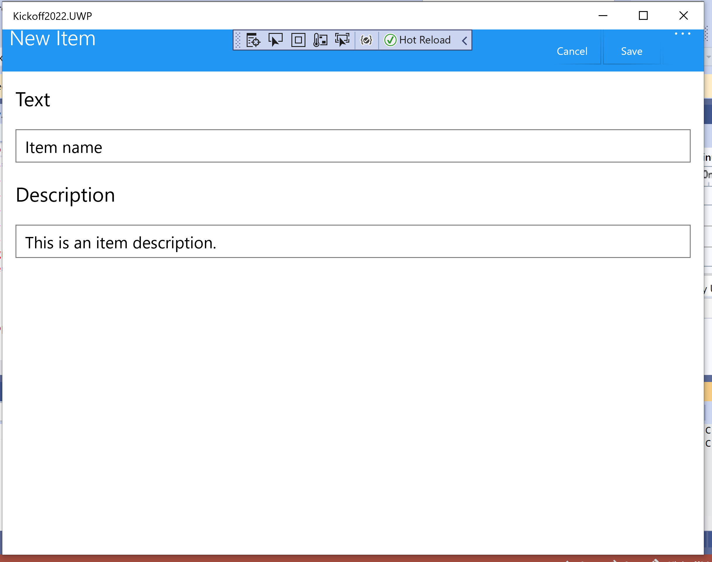

WPF does not show any items or the flyout. However if you click around in the white space you might manage to popuot that flyout (see second screenshot).

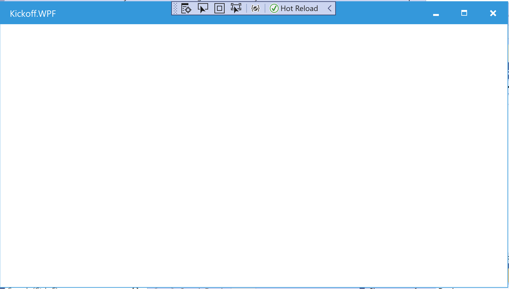

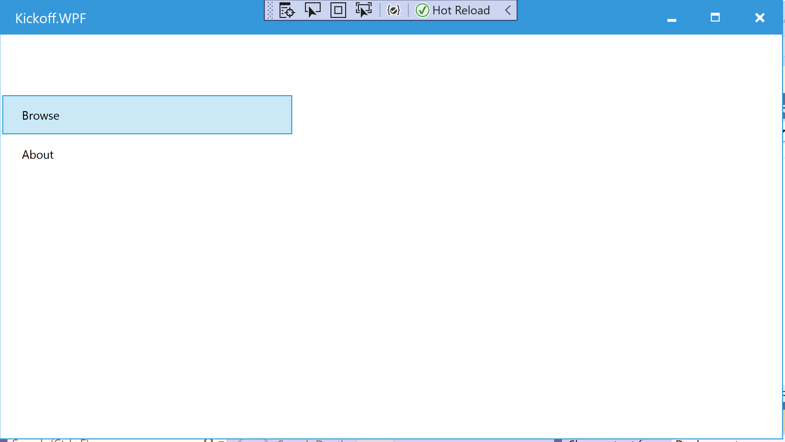

## Linux
You can develop easily from your mac for GTK (gets installed with Visual Studio) and run that same code on Linux (I testet on Ubuntu with Mono Develop IDE - you could also use [jetbrains Rider](https://www.jetbrains.com/rider/) on Linux). Unfortunately it also does not seem to be very mature, yet and does not show any items.

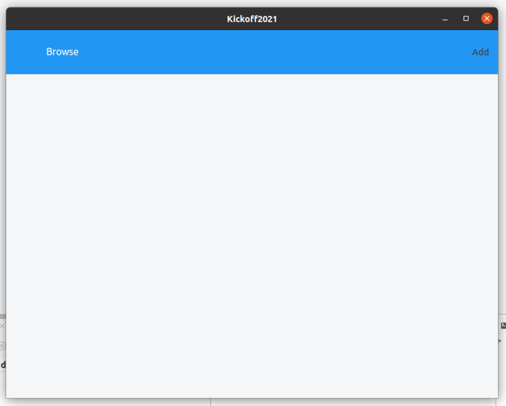

Clicking around in the white space also reveals the flyout as in WPF.

## macOS
While the "out-of-the-box" project does have some hiccups: not showing items and action button.

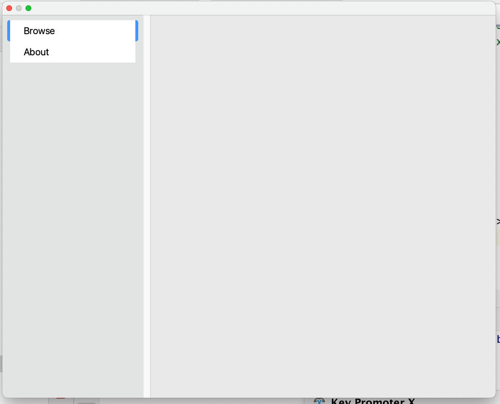

The catalyst version (using [Frank Krugers nuget](https://github.com/praeclarum/Praeclarum.MacCatalyst)) works flawless and snappy:

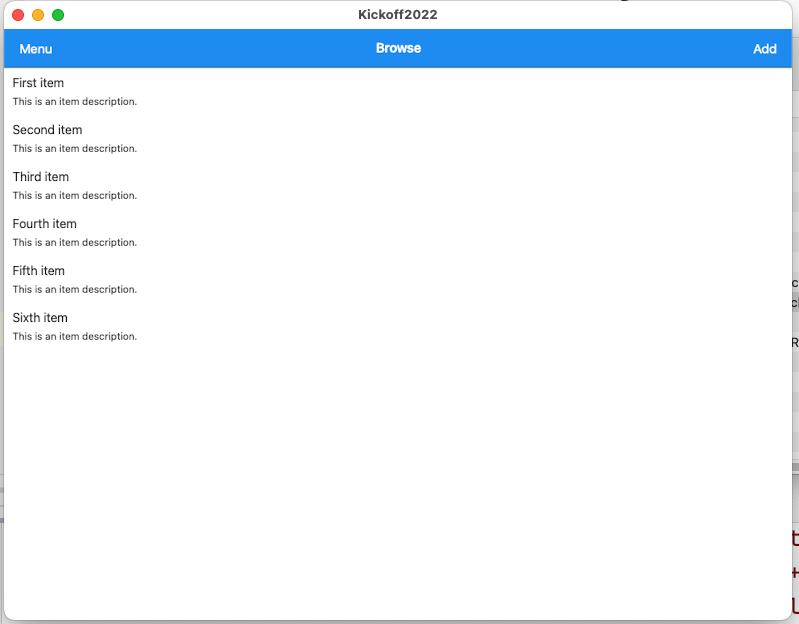

but it is still in alpha state and if I remember correctly apps cannot be signed for the app store, just yet. 

# Conclusion
I was pretty disappointed by the desktop implementations. I had the expectation that the basic file - new - template would work at least. Unfortunately only UWP worked with one minor complaint. I have high hopes that the support for desktop will get better with .net 6 and MAUI since I think I remember from some of David Ortinau's slides that Windows (WinUI3 in the future) and macOs (hopefully Frank's catalyst version) will be supported by Microsoft. From my point of view the current state of Desktop (maybe with exception of UWP) in Xamarin Forms 5 is not ready for production use, yet.

P.S. I found some proof for my earlier claims in one of the [videos from .net Frontend Day](https://www.youtube.com/watch?v=RnyZZKjdUxk).

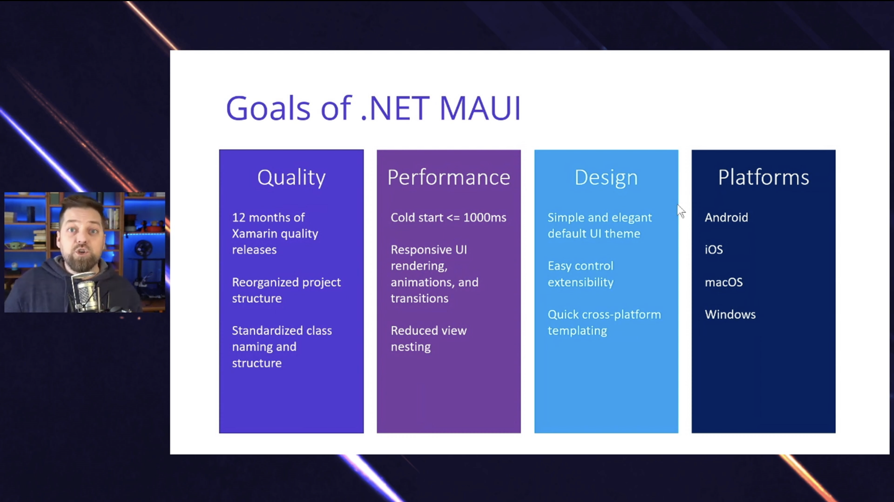

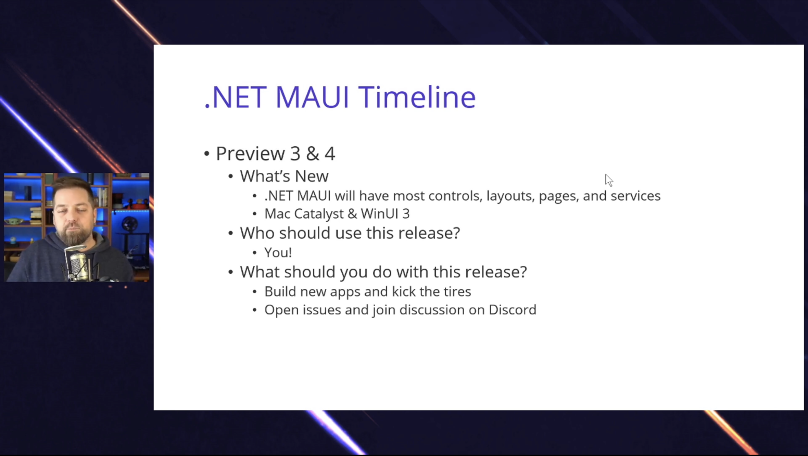

