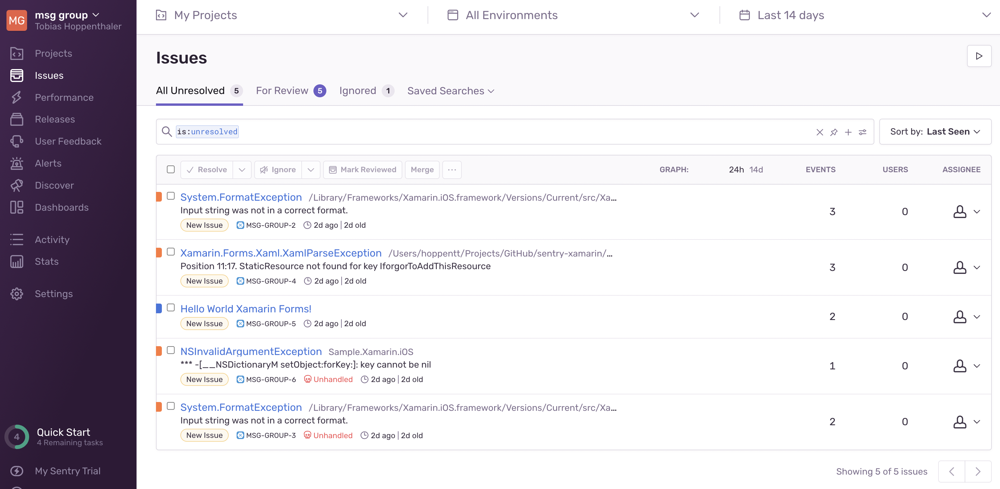
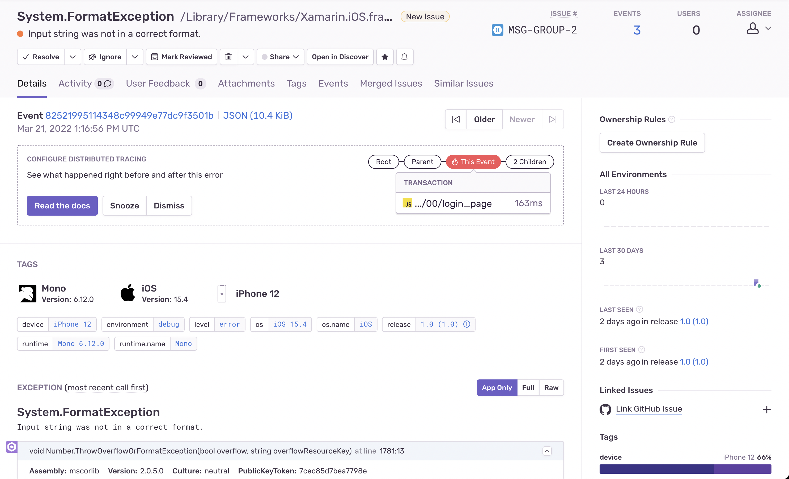
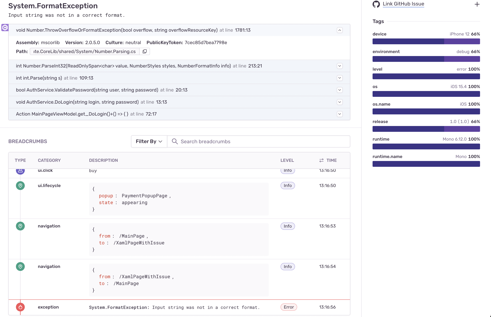
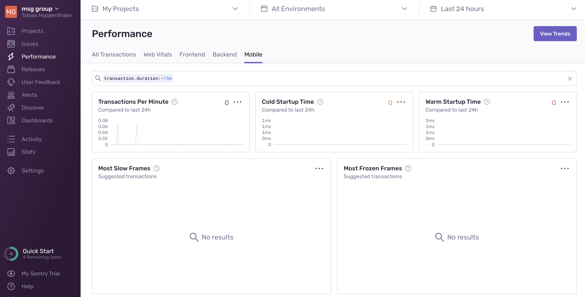

Recently a customer had performance issues in various areas of the app from startup over navigation to http requests. I was tasked with looking into the problem and found some of the problems and solutions to them but I kept thinking that there must be a way to monitor the apps performance continously. I posted on twitter if someone was doing this already, maybe with CI/CD but nothing that really fit for my case came back. Then I was on a phone call with another project lead and he asked, if we use [sentry](https://sentry.io) in our app. I said no and asked him what it was. When he quickly described what they were using it for, I immediately thought that this could be the solution for continous performance monitoring.

### Good news
The good news is: they do have an [sdk for .net](https://docs.sentry.io/platforms/dotnet/) and they even know that [Xamarin exists](https://docs.sentry.io/platforms/dotnet/guides/xamarin/).
There is even a [Xamarin sample app](https://github.com/getsentry/sentry-xamarin/tree/main/Samples) that works when you replace the DSN with your own, but I am getting ahead of myself.

### How to get started
If you want to try it for yourself you should [sign up here](https://sentry.io/signup/) and/or [request a demo](https://sentry.io/demo/). Once you signed up, you can go to _Settings / Projects / your-project / client keys_. That's where you can find your DSN (_The DSN tells the SDK where to send the events to_ is the only description I could find). So this is important, because if you do not use the correct DSN, your events will not show up in the web ui. You can paste this in the demo app and try your luck there right away or integrate in your xamarin app as described [here](https://docs.sentry.io/platforms/dotnet/guides/xamarin/).

### Cool stuff
What you will get from sentry is crash analytics from within your .net runtime, so no native stack trace only, but a .net runtime stacktrace that allows you to really pinpoint the problem:





You can look at different environments (e.g. dev and prod) and releases (Version 1.0 vs. 1.1). You can also set the sample rate of collection, so you for example do not collect 100% of all errors/performance traces, but rather just 25%. 

Why would you do that (from sentry docs):

_Capturing a single trace involves minimal overhead, but capturing traces for every page load or every API request may add an undesirable load to your system.
Enabling sampling allows you to better manage the number of events sent to Sentry, so you can tailor your volume to your organization's needs._

Sentry can log Exceptions, crashes in the vm and also native crashes and you can even send log messages like the infamous "this should never happen" :-D

### Performance monitoring
Sentry allows for automatic and custom instrumentation. For automatic, there is little to nothing to do for you, for custom, you have to define a transaction that will be monitored.



For example for **automatic instrumentation** you could use the SentryHttpMessageHandler like this:

```

var httpHandler = new SentryHttpMessageHandler();
var httpClient = new HttpClient(httpHandler);
var response = await httpClient.GetStringAsync("https://example.com");

```

And after that all http calls would be in the performance monitoring. There's also automatic instrumentation for entity framework core or sqlclient.

For **custom instrumentation** would have to create a transaction like so:

```

// Transaction can be started by providing, at minimum, the name and the operation

var transaction = SentrySdk.StartTransaction(
  "test-transaction-name",
  "test-transaction-operation"
);

// Transactions can have child spans (and those spans can have child spans as well)

var span = transaction.StartChild("test-child-operation");

// ...
// (Perform the operation represented by the span/transaction)
// ...

span.Finish(); // Mark the span as finished
transaction.Finish(); // Mark the transaction as finished and send it to Sentry

```

### Bad news
Well the bad news is that for Xamarin there currently is no measuring the startup time neither cold nor warm start, which is a big bummer because that would be probably one of the most interesting KPIs. I already contacted sentry to see whether that is something they are going to implement. It should be feasible since it is working on Android and iOS for native apps.

### Conclusion
Sentry seems to be a very well equipped tool for live monitoring of your app regarding exceptions/crashes and performance. There are some things missing on the Xamarin front, but the stack traces from within the .net runtime alone and the performance monitoring are a big help. You can even hook it up to your ticketing system and transfer information easily and create tickets automated when more than x occurences of an error are logged (Errors with the same stack trace are also grouped and appear as one entry in the dashboard).
I hope that the startup performance monitoring for Xamarin will be added soon. When I hear back from sentry, I will post that update here.


